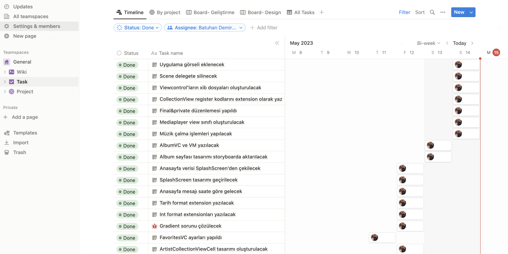
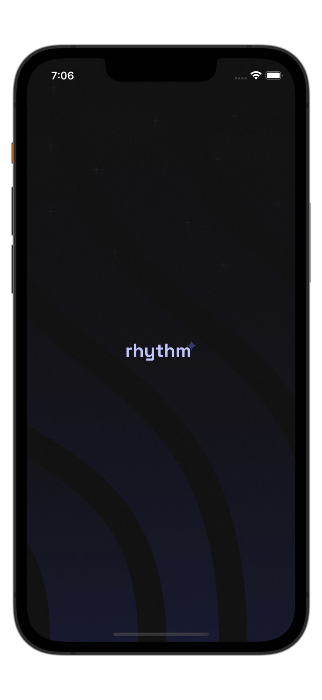
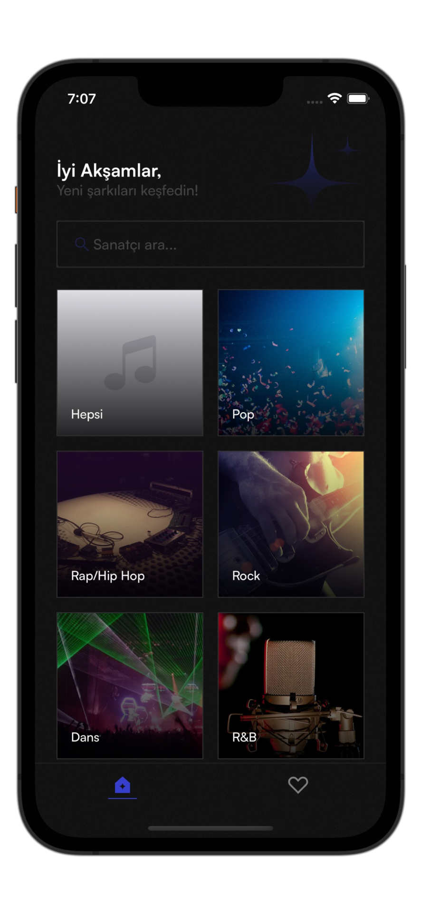
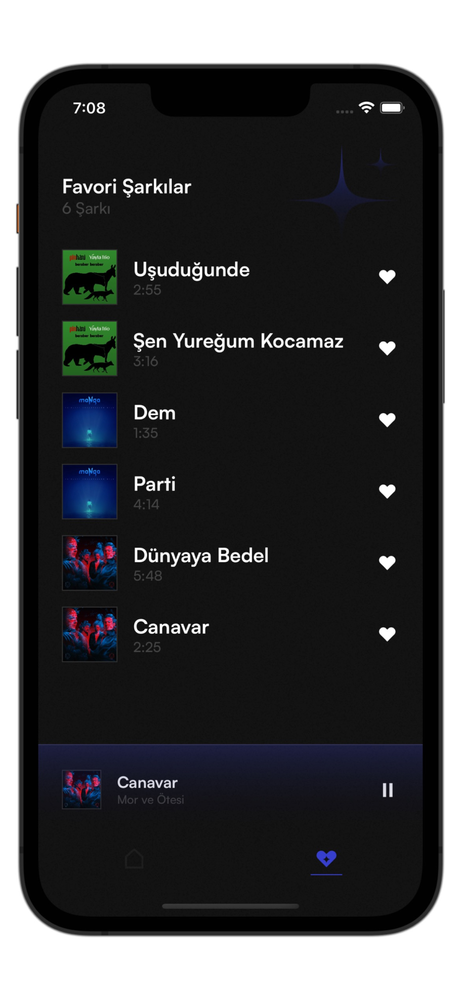
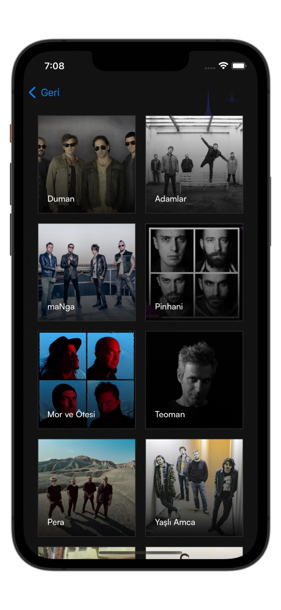
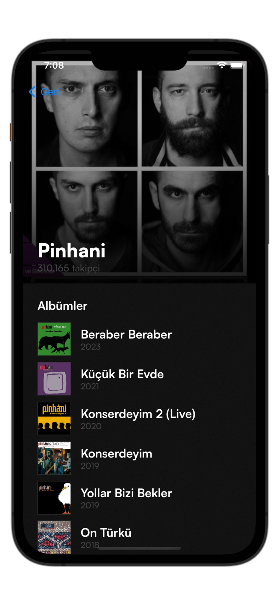
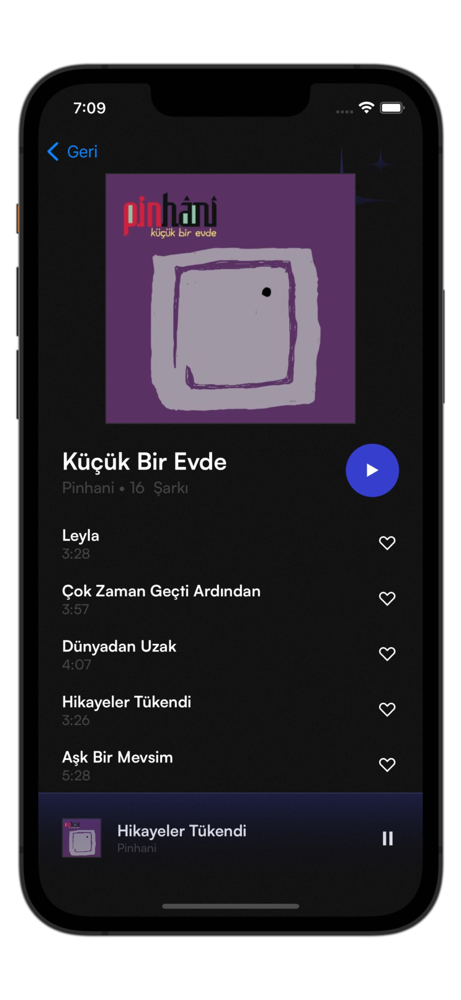
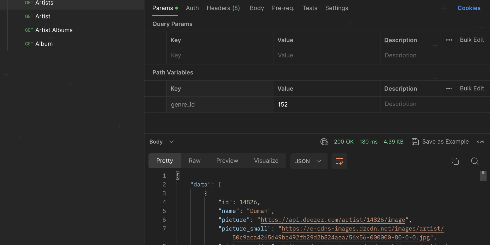

  

## İçindekiler
- [Proje Hakkında](#proje-hakkında)
- [Projede Kullanılan Teknolojiler](#projede-kullanılan-teknolojiler)
- [Proje Yönetimi](#proje-yönetimi)
- [Backend](#backend)
- [Önizlemeler](#önizlemeler)

## Proje Hakkında
Rhythm, Swift ve UIKit kullanarak geliştirdiğim, Deezer API'sine dayanan bir müzik uygulamasıdır. Bu uygulama, kullanıcıların geniş bir müzik kütüphanesinden sevdikleri şarkıları keşfetmelerine, albümlere ve sanatçılara göz atmalarına ve favori parçalarını saklamalarına olanak sağlar.

## Projede Kullanılan Teknolojiler
- Xcode: Sürüm 14.3
- Minimum iOS Sürümü: 15.0
- Mimari: **MVVM**
- Bağımlılık Yöneticisi: Swift Package Manager
- Kütüphaneler: **Alamofire, CoreData, AVFoundation, Kingfisher**

## Proje Yönetimi
Rhythm projesinin her aşaması, geliştirme sürecinden tasarıma kadar, Notion üzerinden yönetildi. Bu süreçte, uygulamanın teknik yönlerinin yanı sıra marka değerini ve kullanıcı deneyimi de göz önünde bulunduruldu. Tüm süreç, başından sonuna kadar Notion'da planlandı.

Notion üzerinde projenin geliştirme sürecini ve takibi görmek için [buraya](https://rhythm-app.notion.site/490696bc3e864f239ca9bcb1bc95c85f?v=0c346faa516c4296995aadd2d865e6ab) tıklayabilirsiniz. Ayrıca proje ile ilgili linklere [buradan](https://rhythm-app.notion.site/c076874c2eb74d1faaa06356f8314fd2?v=ff11edcaaae342e29b69ccc11af2cabd) ulaşabilirsiniz.

  

## Sayfalar
Projenin tasarım süreçleri figma üzerinden design system kullanılarak baştan sonra tasarlanmıştır. İlgili Figma proje alanına [buradan](https://www.figma.com/file/8GyADwXG3hnFmEzXPAIVof/Rhythm--Music-App?type=design&node-id=12%3A833&t=GuknLK9rKXpTJ6oc-1) ulaşılabilir.

| Başlangıç Ekranı  | Ana Ekran | Favoriler Ekranı| 
| ------------- |:-------------:| :-------------:|
|  |  |  |
| Kategori Ekranı |Sanatçı Ekranı | Albüm Ekranı |
|  |  |  |

## Backend
Bu uygulamanın arka uç hizmetleri Deezer API üzerinden sağlanmaktadır. İlgili API'nin dokümanı [buradan](https://developers.deezer.com/api) görüntülenebilir. Kullanım kolaylığı için Postman'e [buradan](https://www.postman.com/batuhandemirbas/workspace/rhythm/collection/23568618-eb3269dc-63b3-4d88-9d5f-57665702c6f1?action=share&creator=23568618) erişilebilir.

  

